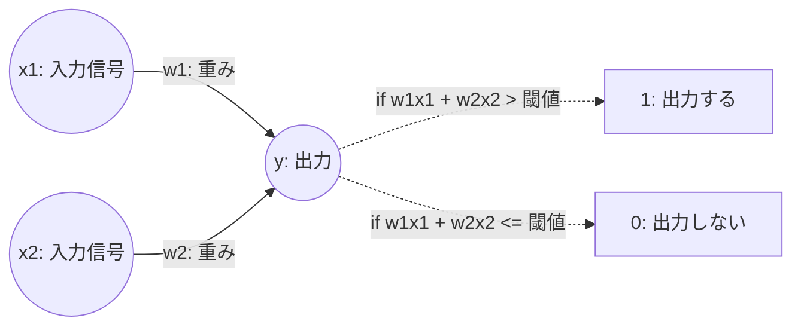

# 基礎理論

## パーセプトロン

### パーセプトロンとは
- 複数の信号を入力として受け取り、一つの信号を出力するアルゴリズム
- 出力する信号は (1 | 0) の二値



### 論理回路

論理回路は二つの信号を受け取り、二値信号の出力を行うため、パーセプトロンの一種とみなせる

#### ANDゲート
x1  | x2 | y
:--:|:--:|:--:
0   | 0  | 0
1   | 0  | 0
0   | 1  | 0
1   | 1  | 1

#### NANDゲート
x1  | x2 | y
:--:|:--:|:--:
0   | 0  | 1
1   | 0  | 1
0   | 1  | 1
1   | 1  | 0

#### ORゲート
x1  | x2 | y
:--:|:--:|:--:
0   | 0  | 0
1   | 0  | 1
0   | 1  | 1
1   | 1  | 1

#### 実装
[00_perceptron.py](./00_perceptron.py)

---

### バイアスの導入
閾値を左辺に移動し、**バイアス**という概念に変換する

(右辺を0にすることにより計算しやすくなる)

```
y = 0 (if: b + w1x1 + w2x2 <= 0)
y = 1 (if: b + w1x1 + w2x2 >  0)

b: バイアス
```

- 各パラメータの役割
    - 重み: 入力信号の重要度をコントロールする
    - バイアス: 発火のしやすさを調整する

上記のパラメータの役割から、ANDパーセプトロンは以下のように考えることができる

- ANDパーセプトロン
    - 重み: 2つの入力信号を同じ重要度とする (`w1 = w2 = 0.5`)
        - あくまで2つの信号の組み合わせのみで出力が決まる
    - バイアス: 25%の確率で発火 (`b = 0.25 - 1 = -0.75`)
        - `(0,0)`, `(0,1)`, `(1,0)`, `(1,1)` の内 発火するのは `(1,1)` のみ

#### 実装
[01_bias.py](./01_bias.py)
