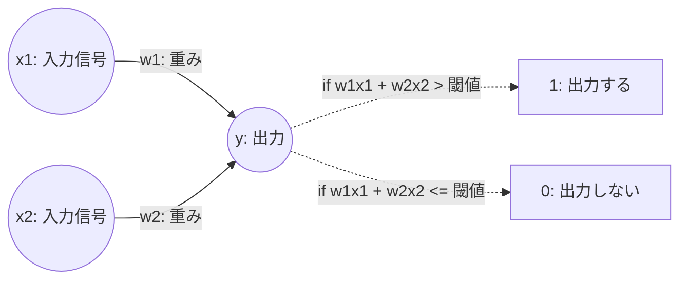

# 基礎理論

## パーセプトロン

### パーセプトロンとは
- 複数の信号を入力として受け取り、一つの信号を出力するアルゴリズム
- 出力する信号は (1 | 0) の二値

### 論理回路

論理回路は二つの信号を受け取り、二値信号の出力を行うため、パーセプトロンの一種とみなせる

#### ANDゲート
x1  | x2 | y
:--:|:--:|:--:
0   | 0  | 0
1   | 0  | 0
0   | 1  | 0
1   | 1  | 1

#### NANDゲート
x1  | x2 | y
:--:|:--:|:--:
0   | 0  | 1
1   | 0  | 1
0   | 1  | 1
1   | 1  | 0

#### ORゲート
x1  | x2 | y
:--:|:--:|:--:
0   | 0  | 0
1   | 0  | 1
0   | 1  | 1
1   | 1  | 1

#### 実装
[00_perceptron.py](./00_perceptron.py)
